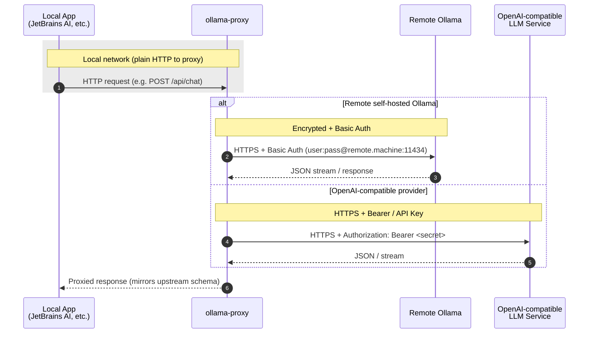

# ollama-proxy
this is a proxy service to wrap local ollama request with a basic auth header and https to remote ollama auth-required service

I created this to call ollama on my remote server to work for me on my local laptop (for example JetBrains AI assistant)

## proxy example



Flow (simplified):

1. Local app always targets `http://localhost:11434` (no auth, HTTP).
2. `ollama-proxy` upgrades outbound leg to HTTPS and injects the appropriate auth (Basic or Bearer/API key).
3. Response / streaming tokens are passed straight through to the local client.

Supported modes:
- Remote native Ollama (basic auth + HTTPS)
- OpenAI-compatible endpoints (standard OpenAI REST / streaming format)

## installation


### using scoop
```powershell
scoop install https://github.com/k88936/scoop-bucket/raw/refs/heads/master/bucket/ollama-proxy.json
```
### Manually
1. [NSSM (Non-Sucking Service Manager)](https://nssm.cc/download) - Download and install NSSM
2. Build the project: `cargo build --release`
3. Run `install.ps1` as administrator:

