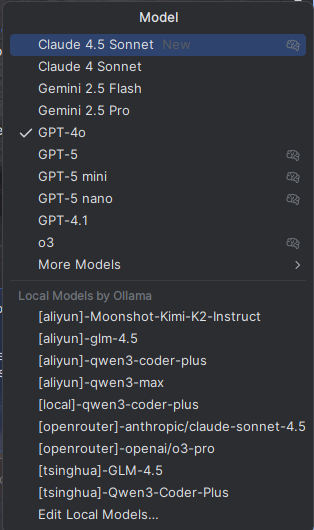
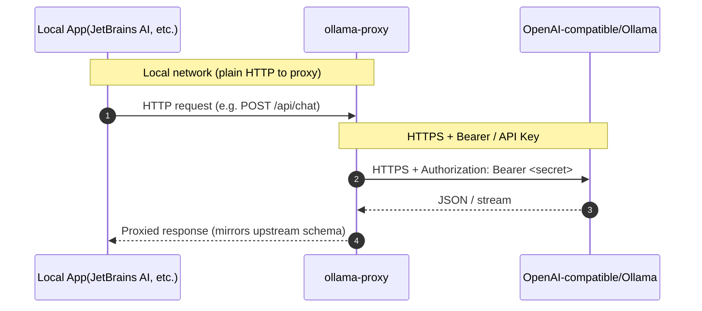

# ollama-proxy
this is a proxy service to wrap local ollama request with a basic auth header and https to remote ollama auth-required or openai-compatible service

I created this to call ollama on my remote server to work for me on my local laptop (for example, JetBrains AI assistant)

## feature
* by adding three providers (each with a tag), the model names are automatically prefixed  
* we can switch to different provider just in the panel
* support attaching Bearer auth to ollama api call, which is important for remote ollama service.




## installation
the artifact is a single executable, I have made an aur and a scoop package with service

### archlinux aur
```shell
yay -S ollama-proxy
sudo systemctl enable --now ollama-proxy@user_name.service
```

### using scoop
```powershell
scoop install https://github.com/k88936/scoop-bucket/raw/refs/heads/master/bucket/ollama-proxy.json
```
### Manually (Windows)
1. [NSSM (Non-Sucking Service Manager)](https://nssm.cc/download) - Download and install NSSM
2. * [Download](https://github.com/k88936/ollama-proxy/releases) the artifact and put it to the content root. 
   * or Build the project and put the artifact to the content root:
   ```powershell
   cargo build --release
   cp target/release/ollama-proxy.exe .
   ```
3. Run `install.ps1` as administrator:
    ```powershell
   ./install.ps1
    ```


## config
in your `$HOME/ollama-proxy.yaml`
example:
```yaml
port: 11434
providers:

- name: ollama
  
# if auth needed, https is a must
  url: https://some.ollama.service:port
  
# can be null 
  secret: null
  models: 
  - qwen3-coder-plus
  api_type: Ollama

- name: aliyun
  url: https://dashscope.aliyuncs.com/compatible-mode/v1
  secret: sk
  models:
  - qwen3-coder-plus
  - Moonshot-Kimi-K2-Instruct
  - qwen3-max
  - glm-4.5
  api_type: Openai

- name: tsinghua
  url: https://llmapi.paratera.com/v1
  secret: sk
  models:
  - Qwen3-Coder-Plus
  - GLM-4.5
  api_type: Openai

- name: openrouter
  url: https://openrouter.ai/api/v1
  secret: sk
  models:
    - anthropic/claude-sonnet-4.5
    - openai/o3-pro
  api_type: Openai
```

## principle
### About proxy and auth

### About model name
The proxy system manages models by attaching a `[provider-name]-` prefix to the model name string shown to the user (e.g., `JB ai-assistant`). The user-selected model name determines the provider, and this name is used to choose the correct provider to handle the request. When the proxy calls the real provider, it uses the original (unmodified) model name string.

